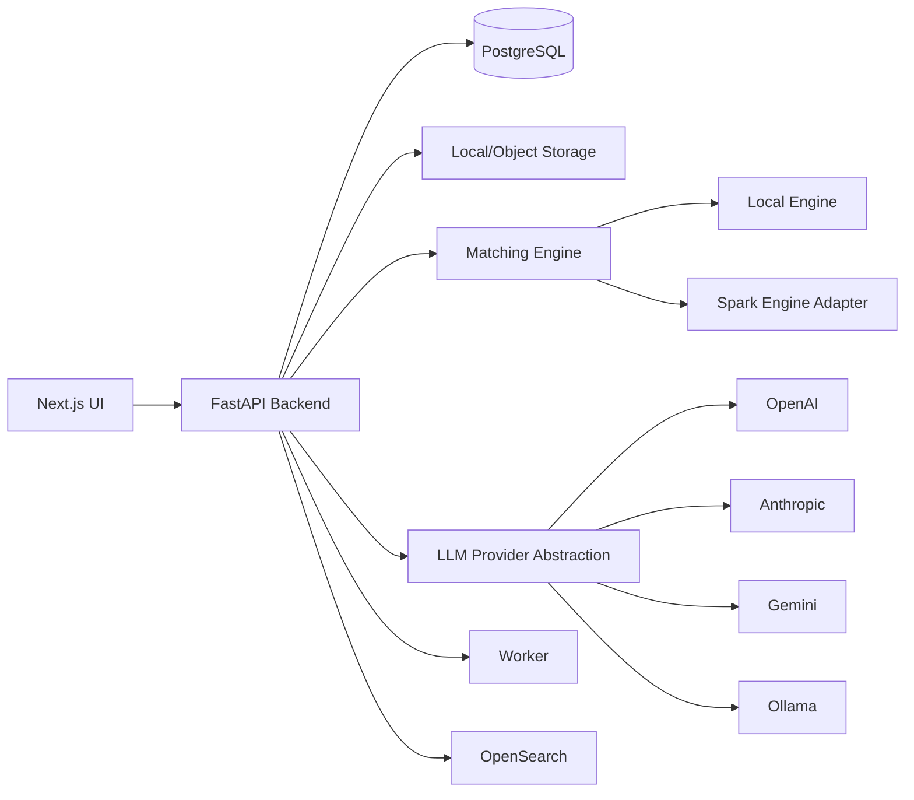

# OpenMatchER

OpenMatchER is an open-source entity resolution and name matching platform for teams that need to upload messy datasets, configure matching strategies, run explainable pipelines, review clusters, and export trusted match results.

It is designed to demonstrate serious entity-resolution engineering: deterministic matching, LLM-assisted adjudication, dataset versioning, experiment tracking, benchmarking, and future-ready distributed execution.

## Why OpenMatchER

- **Entity resolution workbench:** projects, datasets, schema selection, runs, metrics, review, and export.
- **Explainable matching:** normalized evidence, similarity features, final score, reasoning, and decision source.
- **LLM-assisted review:** encrypted provider keys, provider abstraction, structured JSON validation, risk level, and bounded uncertain-pair routing.
- **Benchmark-first development:** demo datasets, precision/recall/F1, false positives/negatives, runtime, memory, JSON and HTML reports.
- **Execution abstraction:** local engine today, Spark adapter for distributed candidate generation and scoring.
- **Open-source ready:** Docker Compose, CI, CodeQL, Dependabot, issue templates, roadmap, security docs, and Apache 2.0 license.

## Architecture



Technical docs:

- [Architecture](docs/ARCHITECTURE.md)
- [Low-Level Design](docs/LLD.md)
- [Scalability Design](docs/scalability.md)
- [Research Workspace](docs/research_workspace.md)

## Quickstart

```bash
docker compose up
```

Then open:

- Frontend: http://localhost:3000
- Backend API docs: http://localhost:8000/docs

Local developer commands:

```bash
make start
make stop
make test
make lint
make format
make benchmark
```

## Demo Workflow

1. Create a project.
2. Upload one of the demo datasets in `examples/`.
3. Select `name` as the matching column.
4. Run the resolution pipeline.
5. Review clusters and feature explanations.
6. Download CSV results.

Demo datasets include companies, people, universities, and products with duplicates, misspellings, aliases, and abbreviations.

## Benchmarks

Run:

```bash
PYTHONPATH=backend:matching:pipelines:llm:embeddings python benchmarks/run_benchmarks.py
```

Outputs:

- `reports/benchmark_results.json`
- `reports/benchmark_results.html`
- `reports/precision_recall_curve.png`
- `reports/roc_curve.png`
- `reports/confusion_matrix.png`
- `reports/scalability_results.json`

The benchmark runner evaluates Levenshtein, Jaro-Winkler, TF-IDF, embeddings, hybrid scoring, and LLM hybrid scoring across the demo company, people, university, and product datasets. The report includes micro/macro precision, recall, F1, runtime, memory, false positives, false negatives, PR/ROC curves, and a confusion matrix for the top model.

The scalability section runs a synthetic blocking/count workload at 1K, 10K, 100K, and 1M records for both the local engine path and Spark `local[*]`. Spark benchmarks require Java and `pyspark`; if Spark cannot start in the current environment, the report marks those rows as skipped instead of projecting numbers.

Current local benchmark snapshot:

| Method | Micro Precision | Micro Recall | Micro F1 | Macro F1 |
| --- | ---: | ---: | ---: | ---: |
| LLM Hybrid | 0.8462 | 0.8980 | 0.8713 | 0.8822 |
| Hybrid | 0.7925 | 0.8571 | 0.8235 | 0.8407 |
| TF-IDF | 0.7959 | 0.7959 | 0.7959 | 0.8083 |
| Embeddings | 0.9630 | 0.5306 | 0.6842 | 0.6670 |
| Jaro-Winkler | 0.9524 | 0.4082 | 0.5714 | 0.5509 |
| Levenshtein | 0.9286 | 0.2653 | 0.4127 | 0.3996 |

These demo datasets are intentionally small and reproducible; the point is to show the progression from conservative string matching to semantic and LLM-assisted matching, not to claim a universal production score.

Amazon-GoogleProducts benchmark:

```bash
PYTHONPATH=backend:matching:pipelines:llm:embeddings \
  python examples/run_amazon_google_products.py --scorer llm_hybrid --threshold 0.35

PYTHONPATH=backend:matching:pipelines:llm:embeddings \
  python examples/run_amazon_google_products.py --scorer llm_hybrid --cross-validate --folds 5

PYTHONPATH=backend:matching:pipelines:llm:embeddings \
  python examples/run_amazon_google_products.py --scorer llm_hybrid --cross-validate --folds 5 --validation entity
```

Current tuned result on the local Amazon-GoogleProducts folder:

| Evaluation | Method | Precision | Recall | F1 |
| --- | --- | ---: | ---: | ---: |
| Fitted full candidate set | LLM Hybrid reranker | 0.9130 | 0.6862 | 0.7835 |
| 5-fold candidate-pair CV | LLM Hybrid reranker | 0.6680 +/- 0.0117 | 0.6845 +/- 0.0143 | 0.6760 +/- 0.0090 |
| 5-fold entity-disjoint CV | LLM Hybrid reranker | 0.7068 +/- 0.1020 | 0.6241 +/- 0.0458 | 0.6596 +/- 0.0605 |

The pair-level report is written to `reports/amazon_google_pair_cross_validation.json`; the stricter entity-disjoint report is written to `reports/amazon_google_entity_cross_validation.json`. The cross-validation scores are the primary generalization estimates. The fitted full candidate-set score is useful as a diagnostic, but it is optimistic because the model is trained and evaluated on the same candidate universe.

## Candidate Generation

OpenMatchER avoids treating entity resolution as a raw O(N²) scoring problem. The matching roadmap separates candidate generation from scoring:

1. Normalize records and compute reusable blocking keys.
2. Generate candidates with exact, token, prefix, phonetic, and sorted-neighborhood blocking.
3. Add embedding or ANN retrieval for semantic candidates.
4. Score candidates with cheap deterministic and vector features.
5. Auto-accept high-confidence matches and auto-reject low-confidence pairs.
6. Route only uncertain pairs to LLM adjudication or human review.

This is also the cost-control story for LLM matching: LLMs are not intended to review every candidate pair. They sit after blocking and cheap scorers, and only see bounded score bands such as `0.70` to `0.88`.

## OpenMatchER vs Splink

| Capability | OpenMatchER | Splink |
| --- | --- | --- |
| Upload/configure/review UI | Yes | No |
| LLM uncertain-pair adjudication | Yes | No |
| Benchmark report with PR/ROC/confusion matrix | Yes | Limited |
| Human review workflow | Yes | Partial |
| Local-first demo workflow | Yes | Yes |
| Spark execution | Adapter and roadmap | Mature |
| Best fit | Productized ER workbench | Large-scale probabilistic linkage library |

Splink is excellent for scalable probabilistic linkage. OpenMatchER is designed as a fuller workbench around the matching lifecycle: upload data, configure matching, compare approaches, review clusters, and export explainable results.

## Screenshots

Screenshots should be captured from the running UI and stored under `docs/screenshots/` before the first tagged release:

- `dashboard.png`: project workspace and summary cards.
- `dataset-upload-preview.png`: upload panel and dataset preview.
- `pipeline-configuration.png`: threshold and LLM uncertain-pair controls.
- `cluster-review.png`: matched pairs with scores and reasoning.
- `benchmark-leaderboard.png`: leaderboard with micro/macro metrics.
- `benchmark-report.png`: generated HTML report with curves and scalability table.

## Repository Layout

```text
backend/       FastAPI API, SQLAlchemy models, services
frontend/      Next.js TypeScript UI
matching/      Normalization, blocking, similarity, clustering, engines
llm/           LLM provider abstraction and structured adjudication
embeddings/    Sentence Transformer adapter
pipelines/     Configurable pipeline runner
benchmarks/    Benchmark runner and report generation
examples/      Demo datasets and benchmark scripts
docs/          Architecture, deployment, security, scalability, research docs
docker/        Container images
tests/         Unit and API tests
```

## Roadmap

- RBAC and multi-tenant authorization.
- Persisted human review queues and active learning.
- Object storage adapters for S3, GCS, and Azure Blob.
- Full Spark-native candidate generation and clustering.
- Model registry and experiment comparison UI.
- Pluggable embedding retrieval and OpenSearch candidate retrieval.

## Contributing

See [CONTRIBUTING.md](CONTRIBUTING.md), [CODE_OF_CONDUCT.md](CODE_OF_CONDUCT.md), and [SECURITY.md](SECURITY.md).

OpenMatchER is Apache 2.0 licensed.
