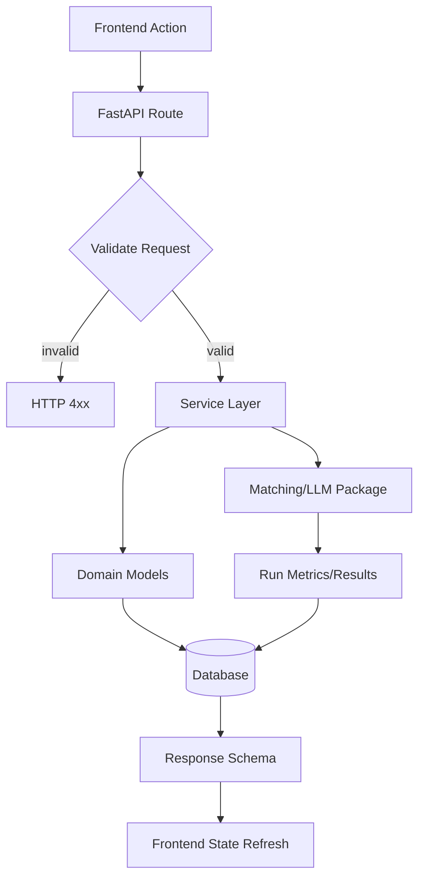
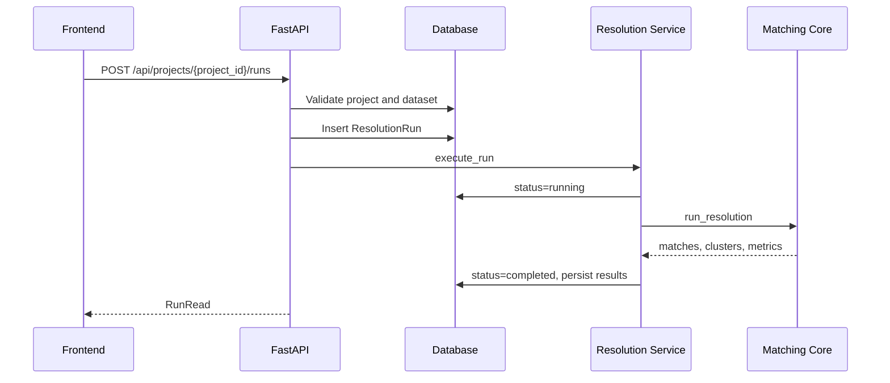

# API

OpenAPI documentation is generated automatically at `/docs`.

## API Flow



## Core endpoints

- `GET /api/health`
- `POST /api/projects`
- `GET /api/projects`
- `POST /api/projects/{project_id}/datasets`
- `GET /api/projects/{project_id}/datasets`
- `POST /api/projects/{project_id}/runs`
- `GET /api/projects/{project_id}/runs`
- `POST /api/settings/secrets`
- `GET /api/leaderboard`
- `POST /api/projects/{project_id}/experiments`
- `GET /api/projects/{project_id}/experiments`
- `POST /api/review-decisions`
- `GET /api/projects/{project_id}/runs/{run_id}/review-queue`
- `GET /api/projects/{project_id}/runs/{run_id}/export`

## Run request

```json
{
  "dataset_id": "dataset-id",
  "name_column": "name",
  "threshold": 0.86,
  "use_llm": true,
  "llm_provider": "openai",
  "llm_model": "gpt-4o-mini",
  "llm_review_min_score": 0.7,
  "llm_review_max_score": 0.88
}
```

## Run Lifecycle



## Match response shape

```json
{
  "entity_a": {"name": "Acme Inc"},
  "entity_b": {"name": "ACME Incorporated"},
  "final_score": 0.94,
  "contributing_features": {
    "jaro_winkler": 0.98,
    "tfidf": 0.91,
    "token_overlap": 1.0
  },
  "reasoning": "Weighted deterministic score from similarity features."
}
```
