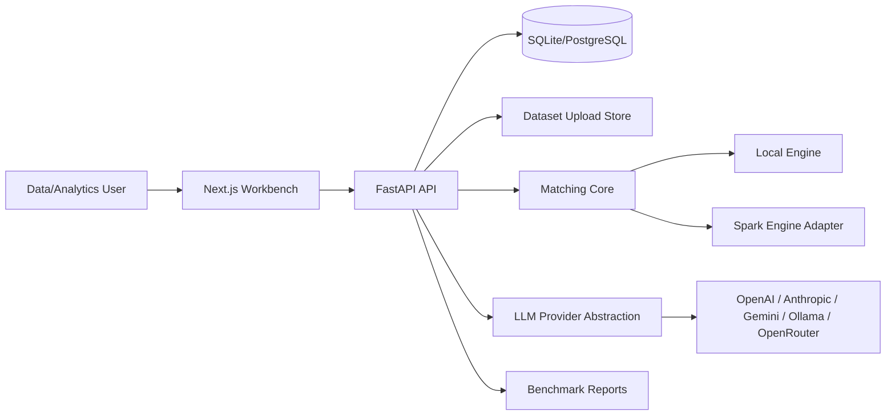
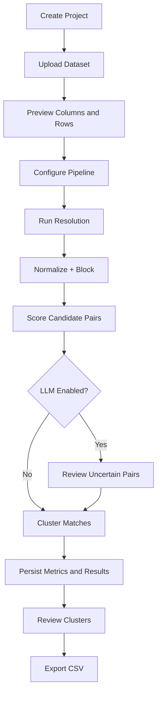
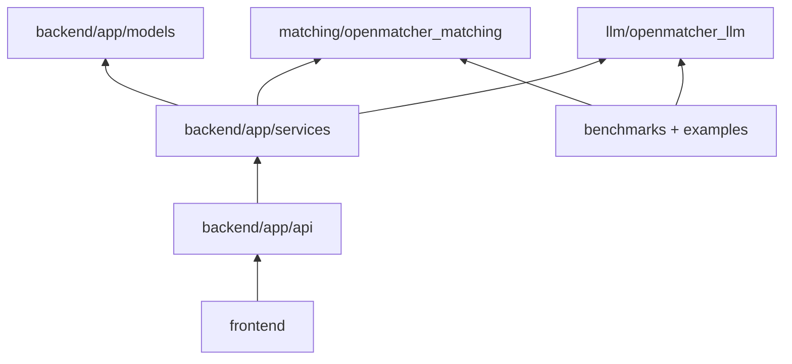

# Architecture

OpenMatchER uses a modular monorepo designed around a clear boundary between product workflow, API orchestration, matching semantics, LLM adjudication, and benchmark research.

For implementation-level diagrams and contracts, see [LLD.md](LLD.md).

## System Context

The backend exposes a FastAPI API over SQLAlchemy models for projects, datasets, versions, runs, experiments, review decisions, audit logs, and encrypted provider secrets. Uploaded files are stored through a local filesystem boundary that can be replaced by S3, Azure Blob, or GCS.

The matching engine is packaged separately from the API so it can run in API workers, command-line benchmark scripts, notebooks, or future distributed jobs. It produces explainable match objects with feature contributions and cluster assignments.

The frontend is a Next.js application that calls the backend directly. It provides the main operational flow: create project, upload data, map schema, run a pipeline, inspect metrics, review clusters, and export CSV results.

## Runtime Flow

## Package Dependency Direction

The intended direction is inward toward reusable matching and LLM packages. The matching core does not import FastAPI, SQLAlchemy, or frontend code.

## Extension Points

- Storage adapters: local filesystem today, object storage later.
- Pipeline execution: synchronous API path today, Prefect worker path later.
- Embeddings: Sentence Transformers service with configurable HuggingFace model names.
- LLM providers: implement one provider interface and register it by name.
- Distributed execution: engine functions operate on records and configuration objects, making Spark or Ray adapters possible without changing API contracts.
- Experiment tracking: datasets, versions, runs, metrics, artifacts, and review decisions are modeled separately for reproducibility.
- Human review: review decisions and active-learning queues provide training feedback for future supervised models.
