# Low-Level Design

This document describes the concrete runtime design of OpenMatchER: API boundaries, data model, matching pipeline, LLM adjudication, benchmark execution, and scaling paths.

## Component View

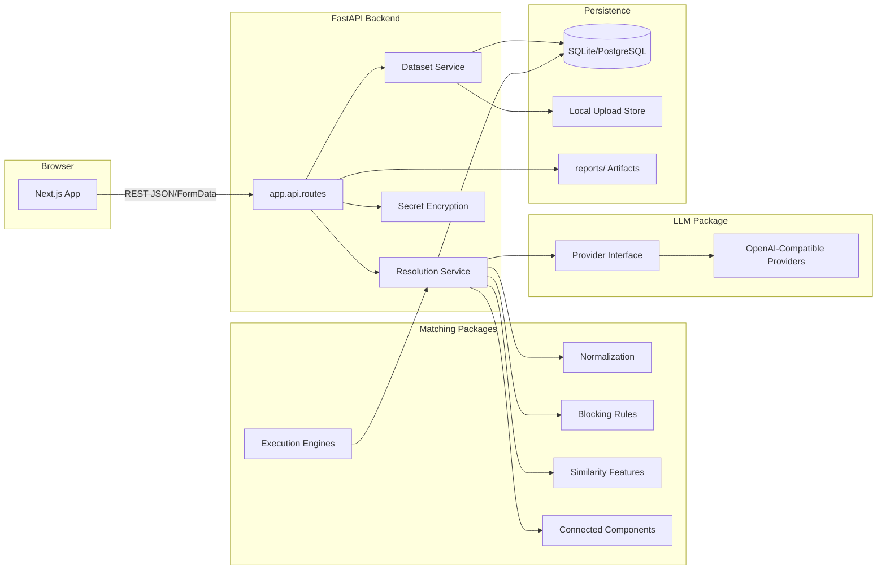

## Module Boundaries

| Layer | Path | Responsibilities | Does Not Own |
| --- | --- | --- | --- |
| Frontend | `frontend/` | Project workflow, upload, run config, cluster review, export, benchmark display | Matching semantics, persistence |
| API | `backend/app/api/routes.py` | HTTP contracts, validation, response shaping, status codes | Scoring algorithms |
| Services | `backend/app/services/` | File persistence, run execution, LLM review orchestration | UI state |
| Domain Model | `backend/app/models/domain.py` | Projects, datasets, versions, runs, experiments, reviews, secrets, audit logs | Algorithm code |
| Matching Core | `matching/openmatcher_matching/` | Normalization, blocking, features, scoring, clustering, engine adapter | HTTP or database concerns |
| LLM Core | `llm/openmatcher_llm/` | Provider abstraction, structured adjudication schema, provider errors | Candidate generation |
| Benchmarks | `benchmarks/`, `examples/` | Reproducible evaluation, reports, cross-validation artifacts | Product API lifecycle |

## Data Model

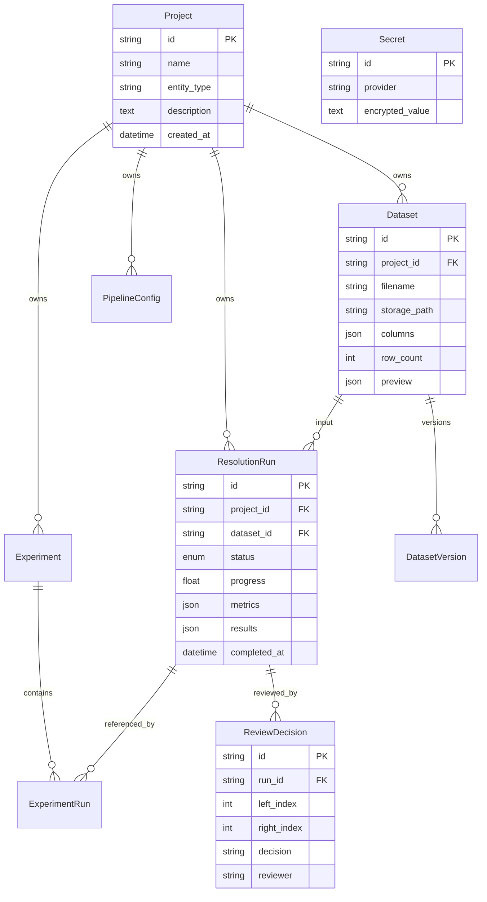

## Upload Flow

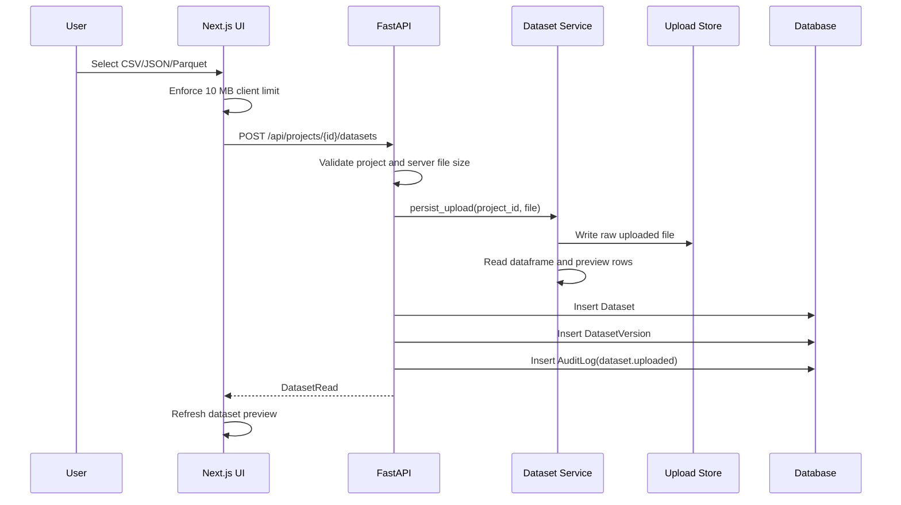

## Resolution Run Flow

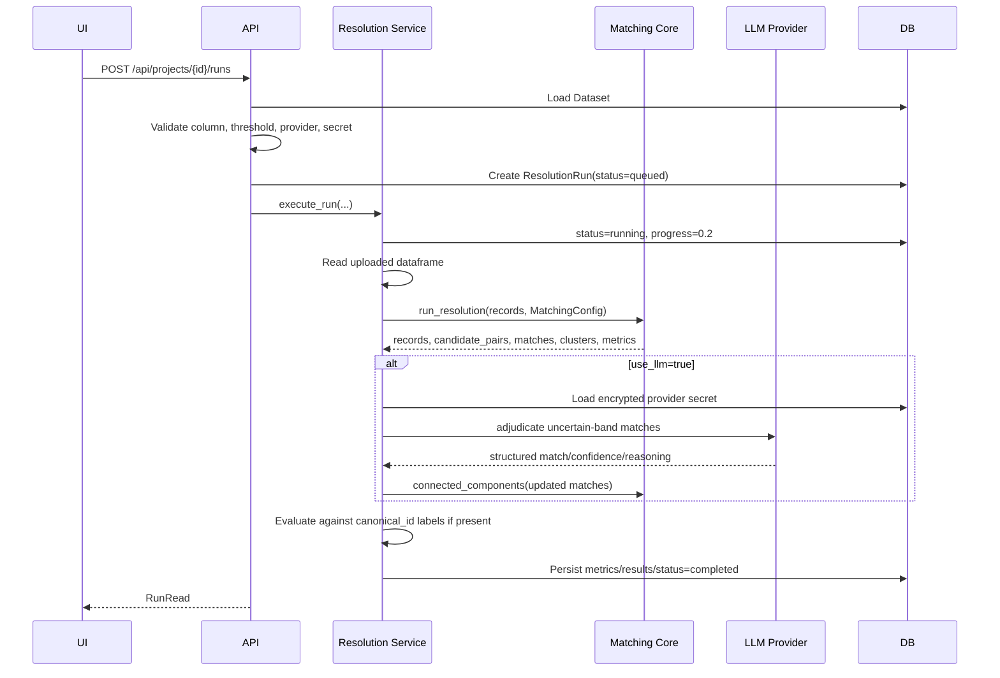

## Matching Pipeline LLD

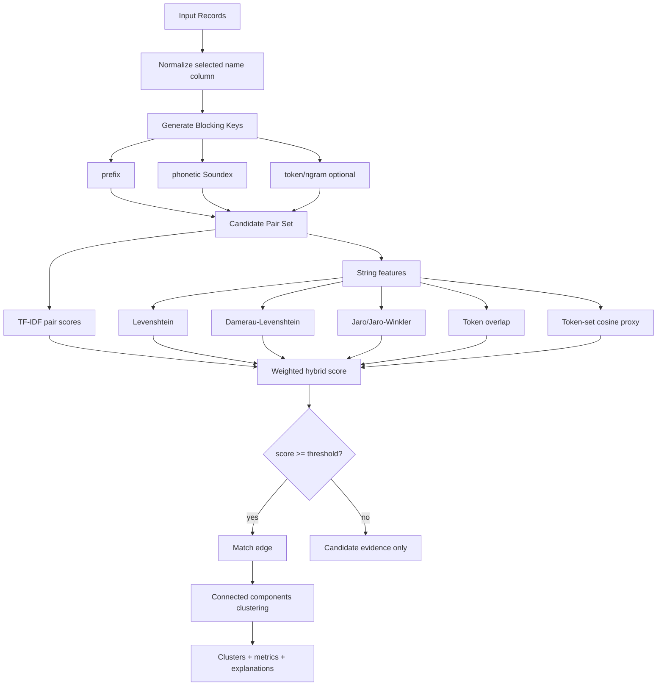

### Matching Contracts

`MatchingConfig`:

```text
name_column: selected field to match
threshold: match edge threshold
blocking_rules: list[BlockingRule]
normalization: NormalizationConfig
```

`run_resolution` output:

```text
records: normalized records
candidate_pairs: count
matches: scored pair objects sorted by final_score
clusters: connected components over accepted match edges
metrics: record_count, candidate_pairs, match_count, cluster_count, average_score
```

## LLM Adjudication Flow

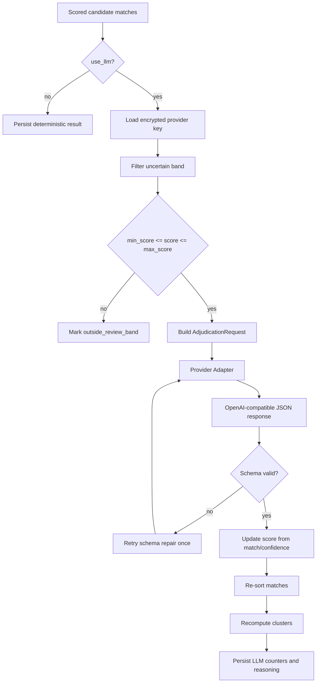

### Cost Control

LLM calls happen after:

1. Blocking has reduced the search space.
2. Deterministic features have scored candidates.
3. High-confidence accept/reject decisions have been made.
4. Only the configured uncertainty band is routed to the provider.

This prevents the system from sending all candidate pairs to an LLM.

## LLM Usage LLD

OpenMatchER uses LLMs as an adjudication layer, not as the primary candidate generator. The production UI path first runs deterministic matching and then routes only uncertain scored pairs to the selected provider.

### Runtime Algorithm

Inputs:

```text
records: uploaded dataset rows
name_column: field selected in UI
threshold: match edge threshold
use_llm: boolean
llm_provider: openai | anthropic | gemini | ollama | openrouter
llm_model: provider model name
llm_review_min_score: lower bound for uncertain-pair review
llm_review_max_score: upper bound for uncertain-pair review
```

Algorithm:

```text
1. Read uploaded dataset into records.
2. Run deterministic resolution:
   a. Normalize selected name column.
   b. Generate candidate pairs through blocking.
   c. Compute similarity features.
   d. Compute weighted hybrid score.
   e. Build initial match list and connected-component clusters.
3. If use_llm is false:
   a. Set llm_reviewed_count = 0.
   b. Persist deterministic result.
4. If use_llm is true:
   a. Validate provider is supported.
   b. Load encrypted API key from Secret table.
   c. Decrypt key only inside backend service boundary.
   d. For each scored match:
      i. If score is outside [llm_review_min_score, llm_review_max_score],
         mark llm_review.reviewed = false and skip provider call.
      ii. If score is inside the band, build AdjudicationRequest.
      iii. Call provider.adjudicate(request).
      iv. Validate structured JSON response.
      v. Convert LLM decision to score:
         - if match=true: score = confidence
         - if match=false: score = 1 - confidence
      vi. Add llm_confidence and llm_score to feature contributions.
      vii. Replace reasoning with provider reasoning.
5. Re-sort matches by final_score.
6. Recompute clusters using updated scores and threshold.
7. Persist metrics, matches, clusters, reasoning, and LLM counters.
```

### Score Conversion

```text
llm_adjusted_score(match, confidence):
    if match:
        return confidence
    return 1 - confidence
```

Examples:

| LLM decision | Confidence | Final score |
| --- | ---: | ---: |
| match=true | 0.94 | 0.94 |
| match=false | 0.91 | 0.09 |
| match=true | 0.62 | 0.62 |
| match=false | 0.55 | 0.45 |

This lets a confident non-match actively suppress a borderline deterministic score.

### Adjudication Request Schema

```json
{
  "record_a": {
    "id": "c5",
    "name": "Amazon",
    "canonical_id": "amazon"
  },
  "record_b": {
    "id": "c7",
    "name": "Amazon.com",
    "canonical_id": "amazon"
  },
  "features": {
    "levenshtein": 0.6,
    "damerau_levenshtein": 0.6,
    "jaro": 0.8667,
    "jaro_winkler": 0.92,
    "token_overlap": 0.5,
    "cosine": 1.0,
    "tfidf": 0.7309
  },
  "blocking_metadata": {},
  "embedding_similarity": null,
  "candidate_context": {}
}
```

### Expected Provider Response

Providers must return JSON matching `AdjudicationResult`:

```json
{
  "match": true,
  "confidence": 0.93,
  "reasoning": "Both records refer to the same Amazon brand variant; .com is a legal/site suffix rather than a distinct entity.",
  "risk_level": "low"
}
```

The backend validates:

```text
match: boolean
confidence: float between 0.0 and 1.0
reasoning: string
risk_level: low | medium | high
```

If the provider returns invalid JSON, the OpenAI-compatible adapter retries once with a schema-repair instruction. If parsing still fails, the provider raises `LLMProviderError`.

### Prompt Contract

The provider receives a compact prompt:

```text
You are an entity-resolution adjudicator.
Determine whether Entity A and Entity B represent the same real-world entity.
Consider feature scores, blocking metadata, embedding similarity, and candidate context.
Return only valid JSON:
{"match": true, "confidence": 0.95, "reasoning": "...", "risk_level": "low"}.

Entity A: ...
Entity B: ...
Feature Scores: ...
Blocking Metadata: ...
Embedding Similarity: ...
Candidate Context: ...
```

The prompt deliberately asks for structured output rather than free-form text so the response can be machine-validated and persisted.

### Worked Runtime Example

Configuration:

```json
{
  "threshold": 0.86,
  "use_llm": true,
  "llm_provider": "openai",
  "llm_model": "gpt-4o-mini",
  "llm_review_min_score": 0.70,
  "llm_review_max_score": 0.88
}
```

Candidate:

```text
Entity A: "Amazon Inc"
Entity B: "Amazon.com"
deterministic_score: 0.7527
```

Decision path:

```text
0.70 <= 0.7527 <= 0.88, so the pair is routed to the LLM.
LLM returns match=true, confidence=0.92.
final_score becomes 0.92.
Because 0.92 >= threshold 0.86, the pair becomes an accepted match edge.
Connected components merges the two rows into the same cluster.
```

Non-match example:

```text
Entity A: "Adobe Premiere Pro CS3 Upgrade"
Entity B: "Adobe Photoshop Elements"
deterministic_score: 0.74
LLM returns match=false, confidence=0.89.
final_score becomes 0.11.
Because 0.11 < threshold, the pair is removed as a match edge.
```

### LLM Review State Stored Per Match

Reviewed pair:

```json
{
  "llm_review": {
    "reviewed": true,
    "match": true,
    "confidence": 0.92,
    "deterministic_score": 0.7527
  },
  "contributing_features": {
    "tfidf": 0.7309,
    "jaro_winkler": 0.92,
    "llm_confidence": 0.92,
    "llm_score": 0.92
  },
  "reasoning": "Provider-generated adjudication reasoning."
}
```

Skipped pair:

```json
{
  "llm_review": {
    "reviewed": false,
    "reason": "outside_review_band"
  }
}
```

### Provider Abstraction

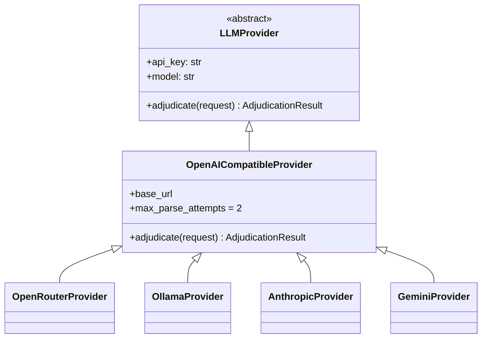

All current providers use an OpenAI-compatible chat-completions shape, but each provider class owns its base URL.

### Error Handling

| Failure | Handling |
| --- | --- |
| Unsupported provider | `400` before run starts |
| Missing provider key | `400` before provider call |
| `llm_review_min_score > llm_review_max_score` | `400` |
| Provider rejects key | `LLMProviderError`, status `401` |
| Provider quota/rate limit | `LLMProviderError`, status `429` |
| Provider network error | `LLMProviderError`, status `502` |
| Invalid provider response | Retry schema repair once, then `502` |
| Pipeline exception | Run marked `failed` |

### Product Path vs Benchmark Path

There are two related but distinct LLM concepts in the repo:

| Path | File | Purpose |
| --- | --- | --- |
| Runtime LLM adjudication | `backend/app/services/resolution.py` + `llm/openmatcher_llm/providers.py` | Calls a selected provider for uncertain candidate pairs in uploaded user datasets. |
| Benchmark LLM hybrid reranker | `examples/run_amazon_google_products.py` | Uses a regularized learned reranker before optional LLM review to evaluate Amazon-GoogleProducts. |

The runtime product path uses real provider calls when `use_llm=true`. The Amazon-Google benchmark path is mostly an offline reproducible evaluation harness; it can call an LLM with `--use-llm`, but its default cross-validation results are produced without provider calls so they are reproducible.

### LLM Review Complexity

```text
N = records
C = candidate pairs after blocking
U = uncertain pairs where min_score <= score <= max_score

Candidate generation: O(C)
Deterministic scoring: O(C * feature_cost)
LLM calls: O(U)

Target invariant: U << C << N^2
```

The quality and cost of the LLM path depend heavily on blocking quality and score-band calibration.

## API Surface

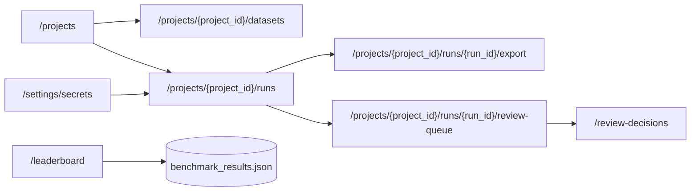

## Benchmark Architecture

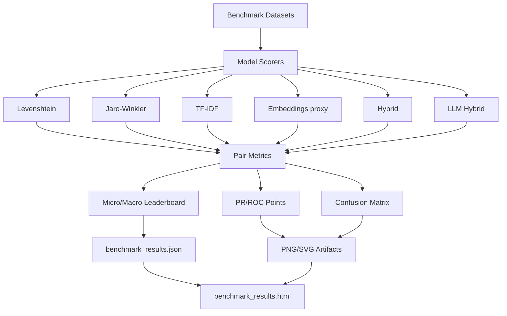

## Amazon-Google Validation LLD

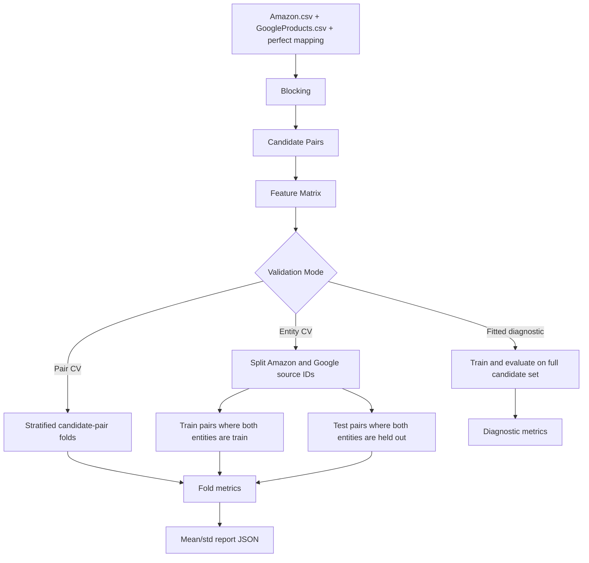

## Execution Engines

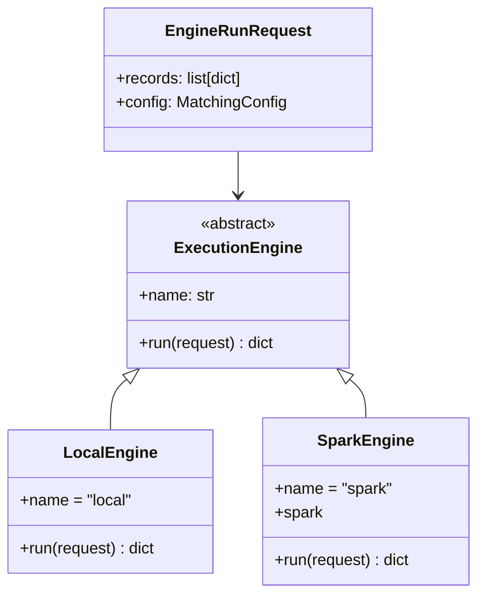

Current Spark adapter creates a Spark dataframe, owns partitioning at the adapter boundary, and delegates scoring semantics back to the matching core. The roadmap is to push normalization, blocking, and candidate generation deeper into Spark while preserving the same match output contract.

## Error Handling

| Failure | Current Behavior |
| --- | --- |
| Unknown project/dataset/run | `404` |
| Upload over 10 MB | `413` |
| Missing selected column | `400` |
| Invalid LLM review band | `400` |
| Missing LLM provider secret | `400` |
| Provider auth failure | `401` mapped through `LLMProviderError` |
| Provider quota/rate limit | `429` mapped to user-readable detail |
| Provider network failure | `502` |
| Pipeline exception | run marked `failed`, exception re-raised |

## Security Boundaries

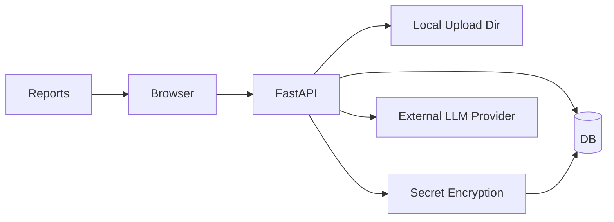

- Provider keys are stored encrypted in the `secrets` table.
- Uploaded datasets are stored outside source-controlled paths under `data/uploads`.
- API rate limiting is enforced through `slowapi`.
- CORS is restricted to configured local frontend origins by default.
- Benchmark output CSVs are ignored under `examples/outputs/` because they can contain dataset-derived rows.
