# Low-Level Design

This document describes the concrete runtime design of OpenMatchER: API boundaries, data model, matching pipeline, LLM adjudication, benchmark execution, and scaling paths.

## Component View

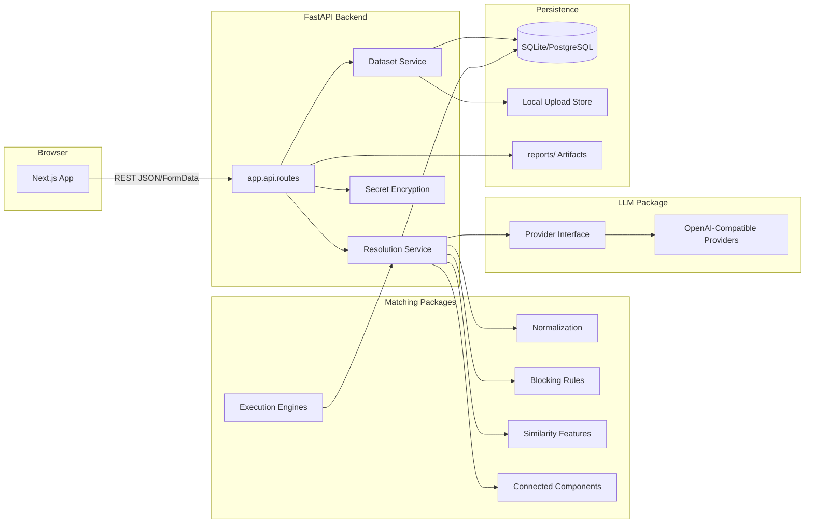

## Module Boundaries

| Layer | Path | Responsibilities | Does Not Own |
| --- | --- | --- | --- |
| Frontend | `frontend/` | Project workflow, upload, run config, cluster review, export, benchmark display | Matching semantics, persistence |
| API | `backend/app/api/routes.py` | HTTP contracts, validation, response shaping, status codes | Scoring algorithms |
| Services | `backend/app/services/` | File persistence, run execution, LLM review orchestration | UI state |
| Domain Model | `backend/app/models/domain.py` | Projects, datasets, versions, runs, experiments, reviews, secrets, audit logs | Algorithm code |
| Matching Core | `matching/openmatcher_matching/` | Normalization, blocking, features, scoring, clustering, engine adapter | HTTP or database concerns |
| LLM Core | `llm/openmatcher_llm/` | Provider abstraction, structured adjudication schema, provider errors | Candidate generation |
| Benchmarks | `benchmarks/`, `examples/` | Reproducible evaluation, reports, cross-validation artifacts | Product API lifecycle |

## Data Model

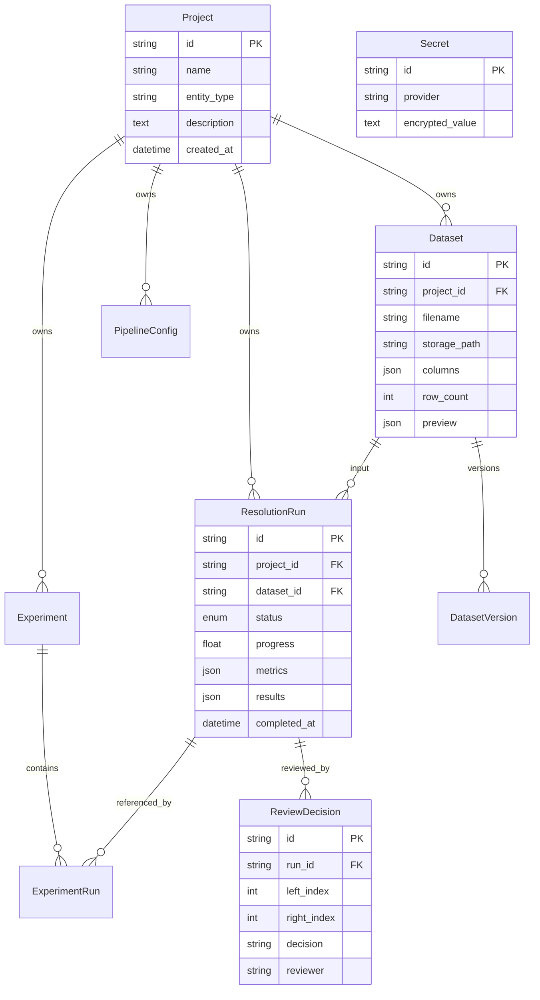

## Upload Flow

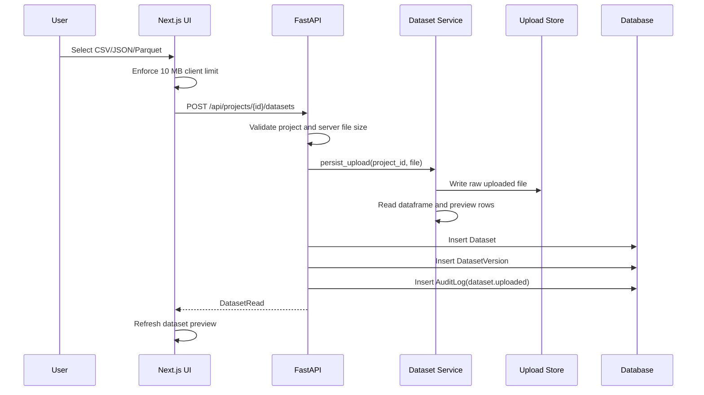

## Resolution Run Flow

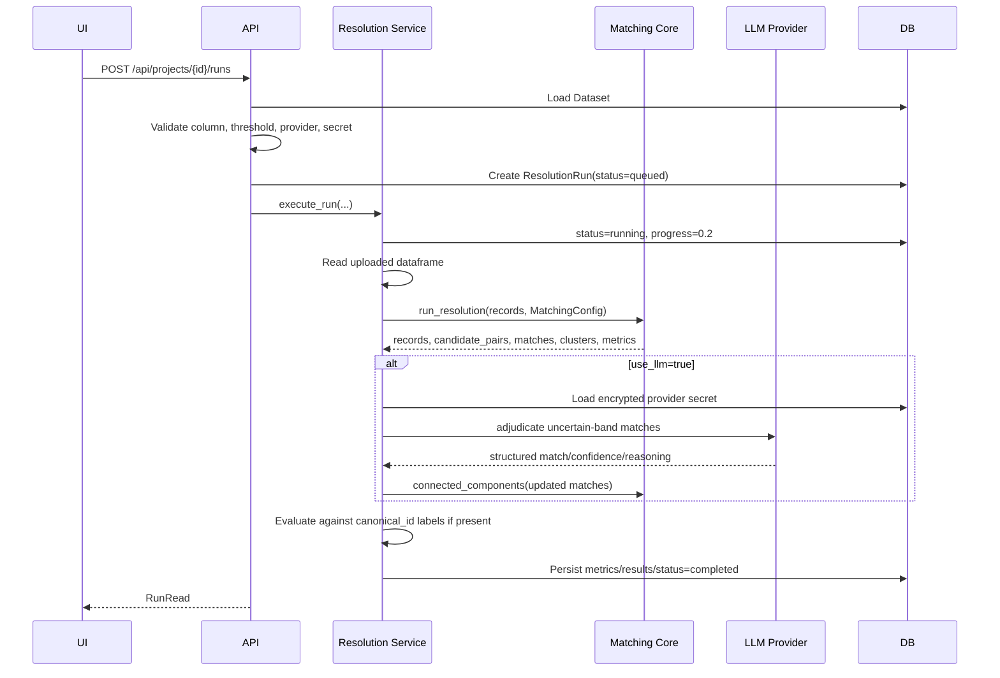

## Matching Pipeline LLD

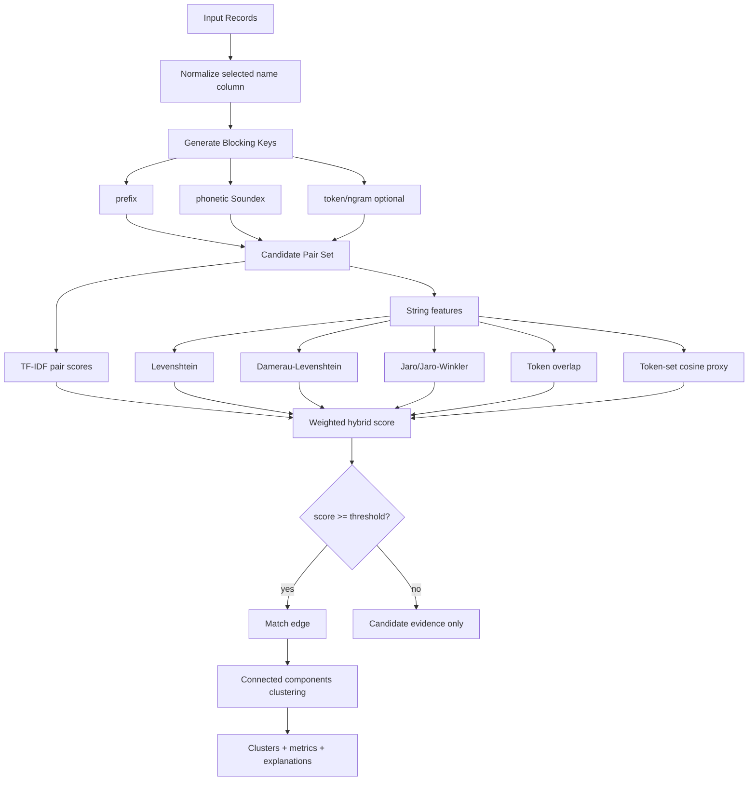

### Matching Contracts

`MatchingConfig`:

```text
name_column: selected field to match
threshold: match edge threshold
blocking_rules: list[BlockingRule]
normalization: NormalizationConfig
```

`run_resolution` output:

```text
records: normalized records
candidate_pairs: count
matches: scored pair objects sorted by final_score
clusters: connected components over accepted match edges
metrics: record_count, candidate_pairs, match_count, cluster_count, average_score
```

## LLM Adjudication Flow

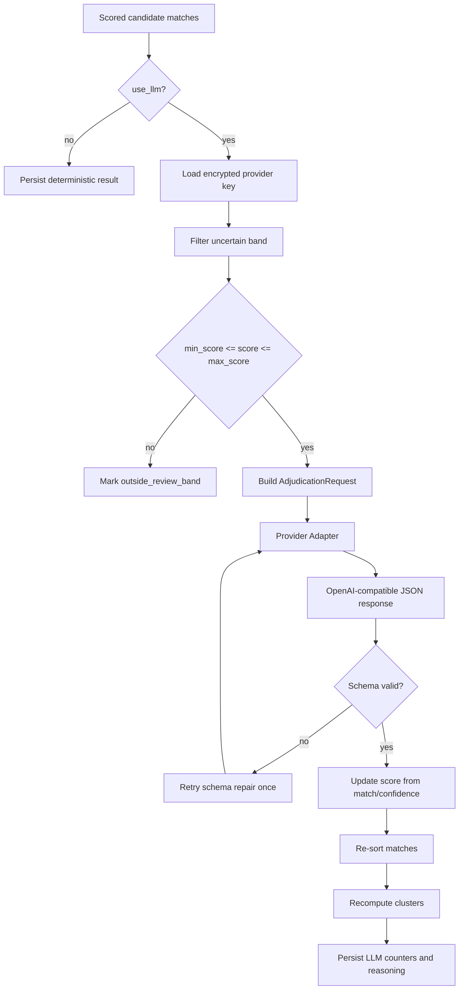

### Cost Control

LLM calls happen after:

1. Blocking has reduced the search space.
2. Deterministic features have scored candidates.
3. High-confidence accept/reject decisions have been made.
4. Only the configured uncertainty band is routed to the provider.

This prevents the system from sending all candidate pairs to an LLM.

## API Surface

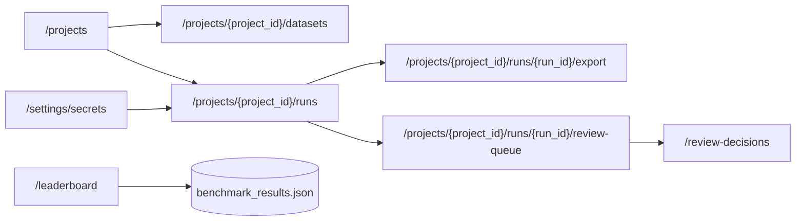

## Benchmark Architecture

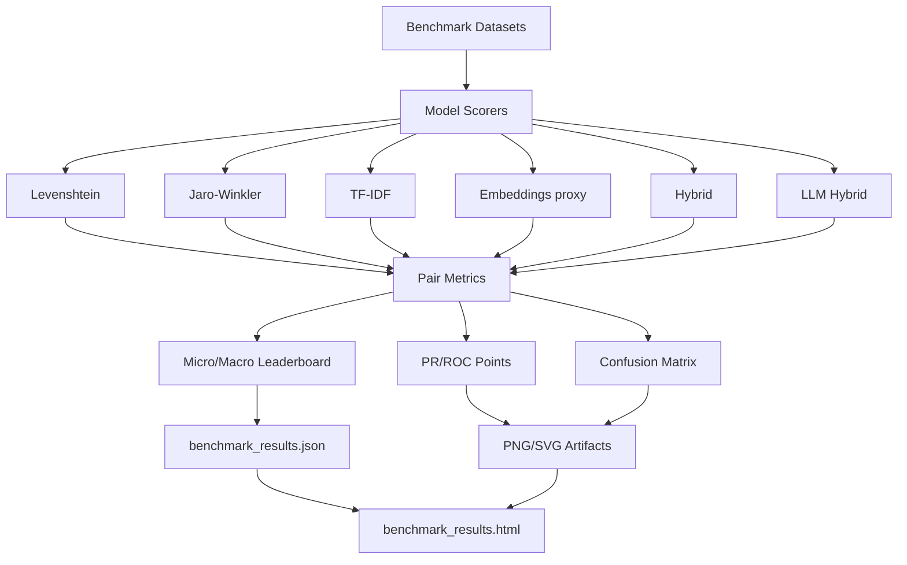

## Amazon-Google Validation LLD

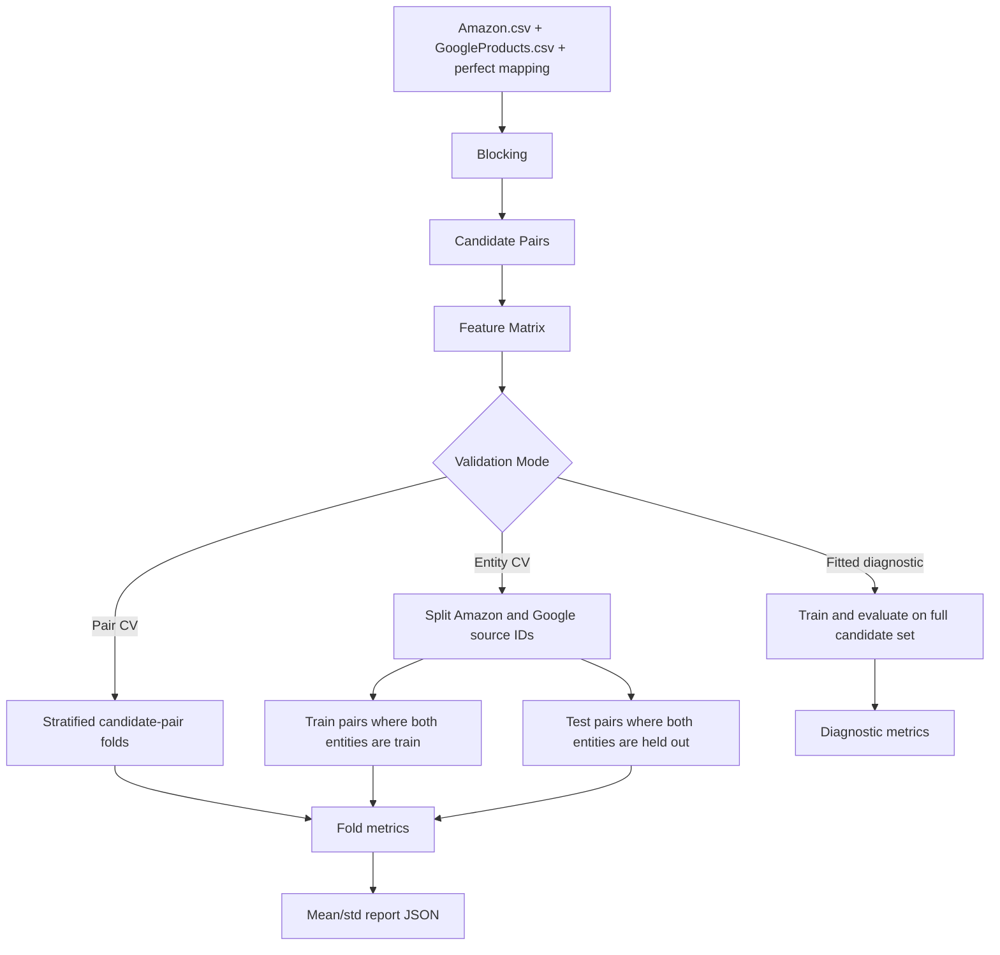

## Execution Engines

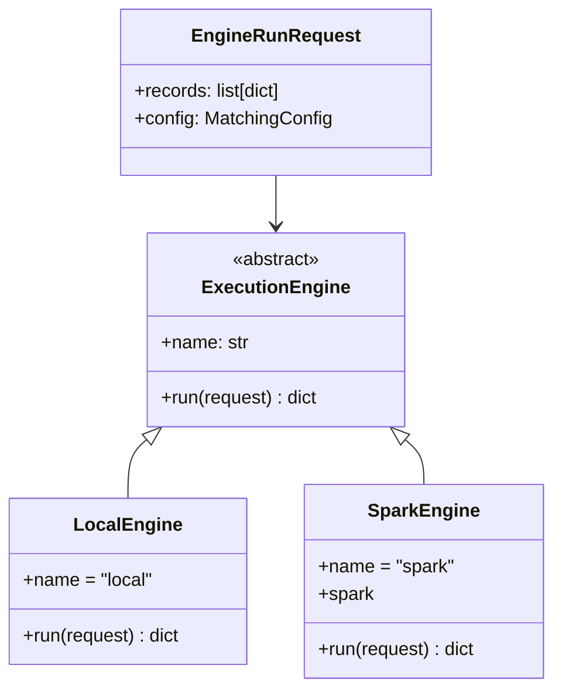

Current Spark adapter creates a Spark dataframe, owns partitioning at the adapter boundary, and delegates scoring semantics back to the matching core. The roadmap is to push normalization, blocking, and candidate generation deeper into Spark while preserving the same match output contract.

## Error Handling

| Failure | Current Behavior |
| --- | --- |
| Unknown project/dataset/run | `404` |
| Upload over 10 MB | `413` |
| Missing selected column | `400` |
| Invalid LLM review band | `400` |
| Missing LLM provider secret | `400` |
| Provider auth failure | `401` mapped through `LLMProviderError` |
| Provider quota/rate limit | `429` mapped to user-readable detail |
| Provider network failure | `502` |
| Pipeline exception | run marked `failed`, exception re-raised |

## Security Boundaries

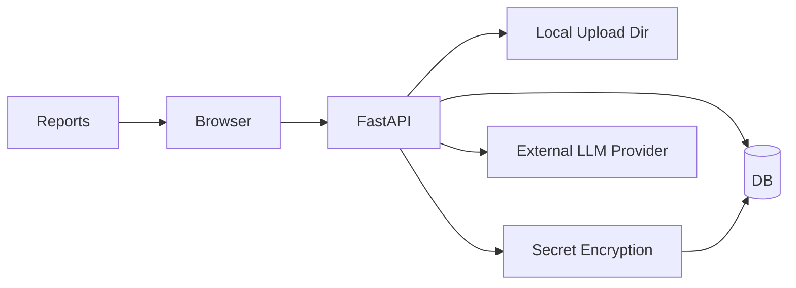

- Provider keys are stored encrypted in the `secrets` table.
- Uploaded datasets are stored outside source-controlled paths under `data/uploads`.
- API rate limiting is enforced through `slowapi`.
- CORS is restricted to configured local frontend origins by default.
- Benchmark output CSVs are ignored under `examples/outputs/` because they can contain dataset-derived rows.
