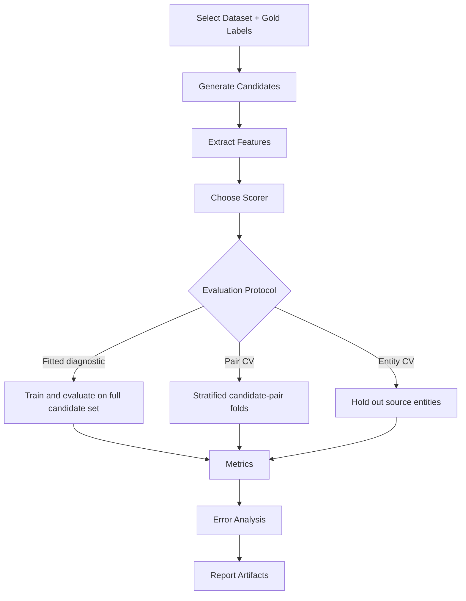
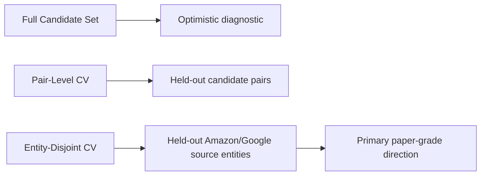

# Research Workspace

OpenMatchER research mode is a structured workflow for comparing matching strategies.

## Experiment Flow

## Compare

- Blocking strategies: prefix, phonetic, n-gram, token, sorted-neighborhood, learned retrieval.
- Similarity methods: Levenshtein, Damerau-Levenshtein, Jaro-Winkler, TF-IDF, embeddings.
- Embedding models: MiniLM, BGE, E5, and custom HuggingFace models.
- LLM models: provider, prompt version, score band, and risk threshold.

## Outputs

- Precision, recall, F1.
- False positives and false negatives.
- Runtime and memory.
- HTML and JSON benchmark reports.
- Exportable prediction CSVs.
- Cross-validation reports such as `reports/amazon_google_pair_cross_validation.json`.
- Entity-disjoint validation reports such as `reports/amazon_google_entity_cross_validation.json`.

## Evaluation Protocols

Full candidate-set scores are useful for debugging feature capacity, but they should not be treated as generalization estimates. Pair-level CV is better, but can still leak entity information when the same source record appears in both train and test candidate pairs. Entity-disjoint CV is stricter because source entities are partitioned before train/test candidate pairs are selected.

## Reproducibility

Research runs should record dataset version, parameters, thresholds, model identifiers, and artifact paths in experiment tracking tables.
