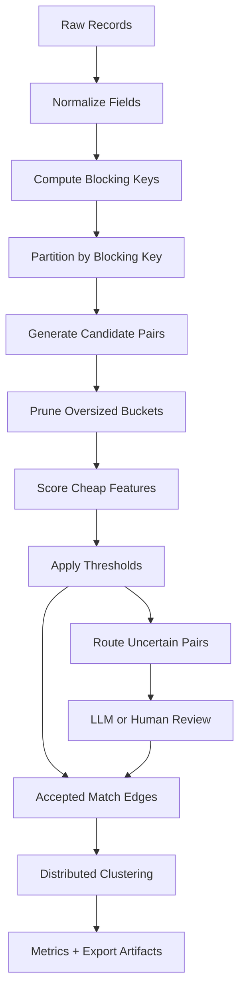
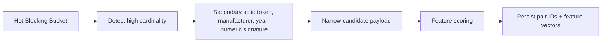

# Scalability Design

OpenMatchER is designed around separable execution engines and deterministic matching primitives so the same matching semantics can run locally, in workers, or on Spark.

## Scaling Flow



The scaling principle is to make candidate generation narrow before any expensive scoring or LLM adjudication happens. The system should never intentionally score every possible pair for large datasets.

## Local Benchmark Harness

Run the benchmark suite with:

```bash
PYTHONPATH=backend:matching:pipelines:llm:embeddings python benchmarks/run_benchmarks.py
```

The suite writes `reports/scalability_results.json` and embeds the same table in `reports/benchmark_results.html`.

The current scalability benchmark is intentionally narrow and reproducible: it measures a synthetic blocking and grouped candidate-count pass at 1K, 10K, 100K, and 1M records. This isolates execution overhead and candidate-count growth without pretending to run full pairwise model scoring over a million records.

When Java and `pyspark` are available, Spark rows are measured with Spark `local[*]`. If Spark cannot start, for example because the execution environment blocks the Py4J local gateway socket, Spark rows are marked as skipped rather than estimated.

Current report fields:

- `engine`: Local Engine or Spark Engine.
- `records`: input record count.
- `runtime_seconds`: measured wall-clock time when available.
- `candidate_pairs`: candidate-pair count after synthetic blocking.
- `mode`: `measured` or `skipped`.
- `notes`: execution details or the skip reason.

## 10M Records

- Partition by project, dataset version, and coarse blocking keys.
- Use prefix, phonetic, and token blocking to avoid quadratic pair generation.
- Persist normalized columns and blocking keys as reusable artifacts.
- Keep candidate generation streaming and materialize only candidate-pair IDs plus feature vectors.

## 100M Records

- Use Spark or another distributed engine for normalization, blocking, and candidate generation.
- Salt high-cardinality or skewed blocking keys.
- Cap bucket sizes and route oversized buckets to secondary blocking rules.
- Store feature vectors in columnar formats such as Parquet.
- Use incremental run metadata to avoid recomputing stable dataset versions.

## 1B Records

- Use multi-stage blocking: coarse retrieval, learned candidate pruning, then expensive scoring.
- Place OpenSearch or vector indexes in front of Spark jobs for candidate retrieval.
- Use adaptive partitioning based on blocking-key frequency.
- Apply one-to-one or graph constraints late, after pruning.
- Emit audit trails and summaries rather than loading all pair evidence in memory.

## Shuffle Reduction



- Precompute normalized fields.
- Use broadcast joins only for small reference sets.
- Split hot buckets by secondary keys such as manufacturer, country, first token, or numeric signatures.
- Keep candidate-pair payloads narrow.

## Cluster Sizing

- Local: up to hundreds of thousands of records for demos and development.
- Spark small cluster: 10M to 100M records with 4-20 workers.
- Spark large cluster: 100M+ records with autoscaling, external shuffle service, and object storage.
